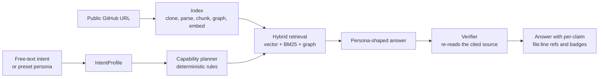
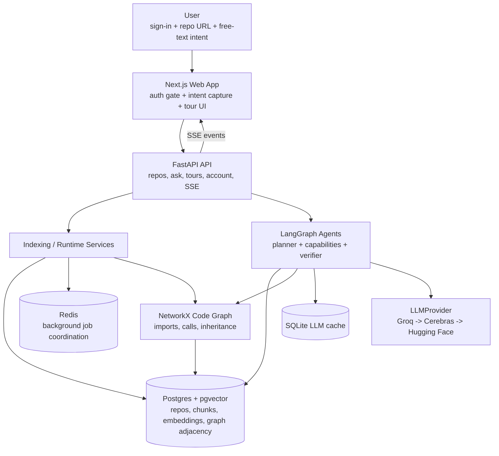
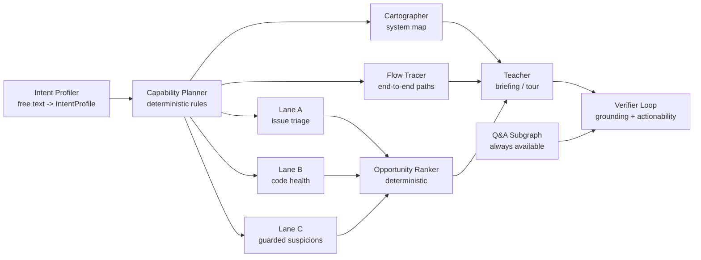
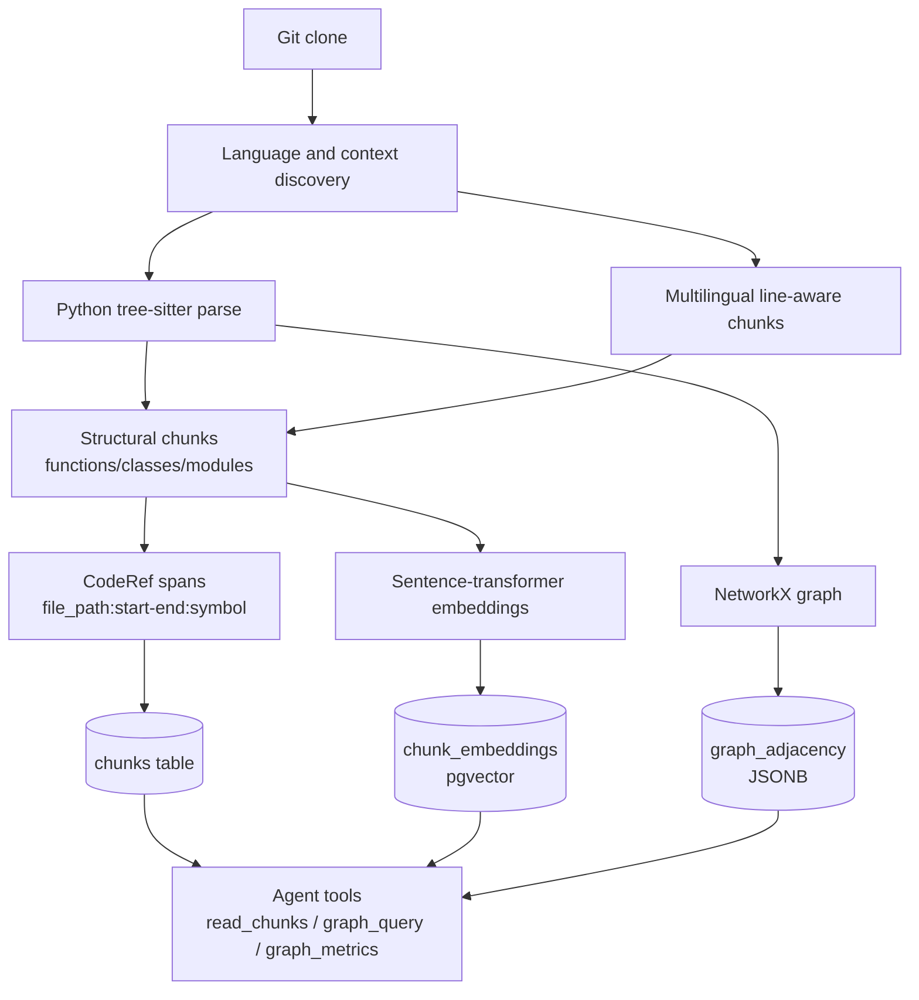
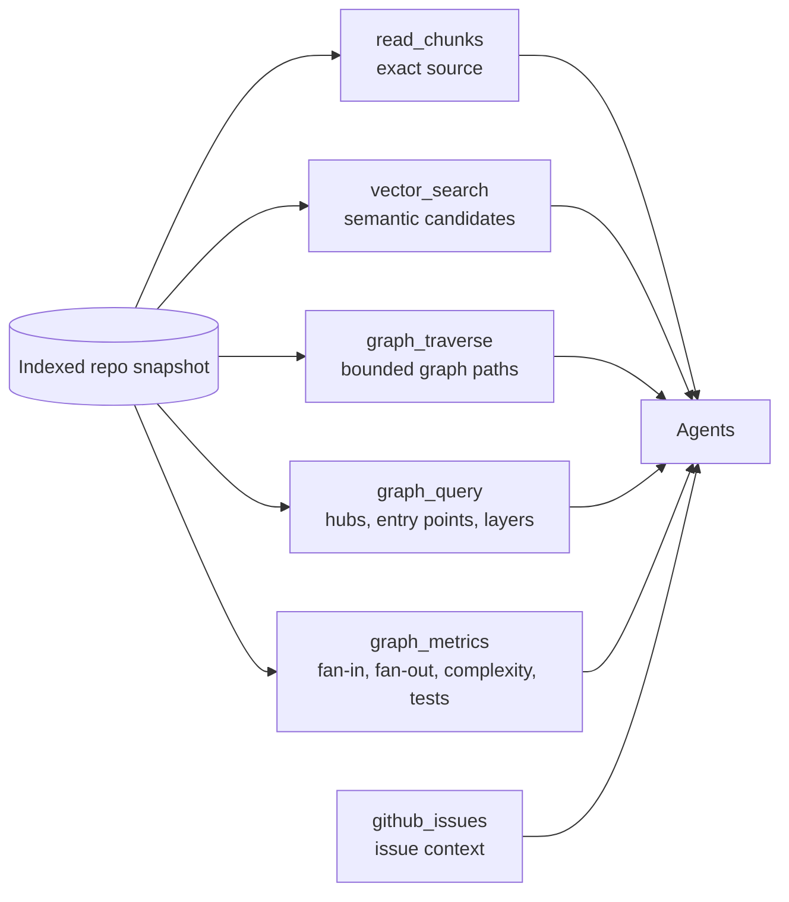

# RepoPilot

**Paste a public GitHub URL, say why you are here, and get a guided tour of the codebase where every factual claim is tied to a real `file:line`.**

Reading an unfamiliar repository is not a search problem. The hard part is not finding a function — it is knowing which twenty of four thousand functions matter *for what you are trying to do*, and being able to trust what you are told about them. A first-time contributor, a security reviewer, and someone evaluating the library for adoption are looking at the same code and need three different tours.

RepoPilot is built around that: **it asks why you are here before it analyzes anything**, and every downstream step adapts to the answer.

> **There is no hosted instance — RepoPilot runs on your machine.** It is open source because we are not operating it as a service: you clone it, bring your own free Groq key, and everything stays local. [Quickstart](#run-it-locally) below, full runbook in the [startup guide](docs/STARTUP_GUIDE.md). Self-hosting on a server is possible but optional — see the [deployment guide](docs/DEPLOYMENT.md). Where the project stands day to day is in [docs/STATUS.md](docs/STATUS.md).

---

## The two bets

**1. Pre-context beats post-filtering.** Most code assistants answer the question you typed. RepoPilot first captures a short statement of intent — either a preset persona (open-source contributor, security reviewer, adopter, learner, maintainer, competitive analyst) or free text like *"I'm writing a migration guide and need the breaking changes"* — and turns it into a structured `IntentProfile`. That profile decides which analysis capabilities run at all, and what shape the answer takes: a narrative, a ranked list, a dossier, a comparison table. The persona changes what the answer *does*, not just its tone.

**2. Deterministic facts, generated prose — never the reverse.** The call graph is built by an AST, not guessed by a model. Retrieval is hybrid vector + keyword + graph. Every factual claim carries a `CodeRef` (`file_path:start-end:symbol`), and before an answer reaches you a **verifier** re-reads the cited source and asks whether the claim is actually supported. Unsupported claims are labelled and shown, never silently deleted — a flagged claim is information, a disappeared one is a lie by omission.

The rule the whole project is organised around: **truthful over fluent.** If the system does not know, it says so.

---

## What you get

- **A grounded answer with expandable citations.** Each claim can be opened inline to the exact source it cites, with real line numbers.
- **Per-claim verification badges.** Verified, flagged, or unverified — visible, not buried.
- **A "Related code" panel.** Expand any claim into what it calls, what calls it, what it inherits from, what imports it — walked from the AST graph, several hops deep, one request per step.
- **Answers streamed as they generate**, over SSE, with a first-impression summary while indexing is still running.
- **Saved tours.** Sign in with Google or GitHub and your tours follow you across devices.
- **Bring your own key.** Connect a Groq key (optionally a Hugging Face token) and your questions run on it. Keys are encrypted at rest and never stored in the browser.

---

## How it works



**Indexing.** The repository is shallow-cloned, then parsed: Python through tree-sitter into an AST-level graph of imports, calls and inheritance; TypeScript/JavaScript, Java/Kotlin, Go, Rust, C/C++, C#, Ruby, PHP, Swift, Scala, Vue/Svelte and shell into bounded line-aware chunks. READMEs and dependency manifests are indexed too, because "what is this project" is usually answered there. Every chunk keeps its exact source span, so a citation is a location rather than a paraphrase. Chunks are embedded into pgvector; the graph is stored as JSONB adjacency.

**Answering.** Retrieval fuses a dense lane (pgvector) and a sparse lane (Postgres full-text, BM25-style `ts_rank_cd`), reranks the pool with a cross-encoder, and diversifies with MMR so five neighbouring lines of the same file do not crowd out the rest. Graph facts — fan-in, hubs, entry points, neighbours — come from the stored adjacency, never from the model. The answer prompt is assembled from those chunks, shaped by the persona.

**Verifying.** Each claim goes back to the verifier with the source it cites and one question: *is this fully supported?* A rejected claim gets one recheck against the wider context the answerer actually saw, because the most common failure is not a fabricated claim — it is a true claim citing the wrong chunk. What survives is badged; what does not is flagged in place.

---

## Architecture



**Stack.** Python 3.12 backend (FastAPI, LangGraph, Pydantic v2, SQLAlchemy, tree-sitter, NetworkX, fastembed), Next.js 15 + React frontend, Postgres with pgvector, Redis for background indexing jobs. Models are reached through one provider layer with an explicit fallback chain — Groq, then Cerebras, then optionally Hugging Face — with SQLite response caching and 429-aware retry budgets.

### The agent graph

One shared `ArchaeologistState` flows through the graph. The intent layer always runs first; the planner then activates only the capabilities the stated intent justifies. There is deliberately **no `learn | contribute | audit` enum** — planner rules read continuous intent weights and raw-text signals, because real users do not fit three buckets.



Lane C — "this looks worth investigating" — is deliberately constrained: it must use guarded language, never assert a bug, and always end with a confirmation step before anything resembling a patch. That constraint is enforced in the prompt *and* post-checked by the verifier.

### Facts in, language out

The code graph built from the target repository is what makes grounding possible:



Six deterministic tools are the boundary between fact and prose. Adding a seventh requires a justification that starts with *"the model cannot do this from the existing tools because…"*.



---

## Design principles

These are enforced in review and CI, not aspirational:

- **Truthful over fluent.** Claims need `CodeRef` spans. Unknown means "I don't know".
- **No stat dumps.** Metrics become `Insight` objects with a consequence — an empty "so what" fails validation by design.
- **Intent first.** Every capability reads the user's stated purpose.
- **Deterministic facts, LLM narration.** Parsing, graph construction, retrieval and metrics are tool-driven.
- **Verifier wrapped.** Unsupported claims are flagged, not silently shipped.
- **No fixed purpose enum.** Continuous intent weights, not three branches.

---

## Run it locally

Everything runs on your machine. The only account you need is a free Groq key.

### 1. Install the toolchain

| Need | Version | Install |
|---|---|---|
| Python | 3.12 (`<3.14`) | Installed for you by `uv` — no system Python required |
| [uv](https://docs.astral.sh/uv/) | latest | `curl -LsSf https://astral.sh/uv/install.sh \| sh` (macOS/Linux) · `winget install astral-sh.uv` (Windows) |
| Node.js | 22 | [nodejs.org](https://nodejs.org/) or `nvm install 22` |
| Docker | any current | [Docker Desktop](https://www.docker.com/products/docker-desktop/) — must be **running**, it hosts Postgres and Redis |
| Git | any | preinstalled on macOS/Linux |

### 2. Get a free LLM key

Sign up at [console.groq.com](https://console.groq.com/) and create an API key. The free tier is enough for real tours; it rate-limits on large repositories. Optional extras: a [Cerebras](https://cloud.cerebras.ai/) key and a [Hugging Face token](https://huggingface.co/settings/tokens) act as fallbacks when Groq returns 429.

### 3. Set it up

```bash
git clone https://github.com/iprashantraj/RepoPilot.git
cd RepoPilot
cp .env.example .env      # then put your key in GROQ_API_KEY=
make setup                # uv sync + npm install
make services             # Postgres + pgvector and Redis, then DB migrations
make dev                  # API on :8000, web on :3000
```

Open `http://127.0.0.1:3000` and paste a public GitHub repo URL.

Prefer not to install any of it? The repo ships a [devcontainer](.devcontainer/devcontainer.json) — open it in VS Code or a GitHub Codespace, and `uv`, Node 22, Docker and the dependencies are set up for you. You still supply the Groq key and run `make services && make dev`.

**First run downloads models.** The embedder (~130 MB) and the reranker (~91 MB) land in `~/.cache/huggingface` on the first indexing job, so the first repository is slower than every one after it. Start with something small — `pallets/flask`, `encode/httpx` — rather than a monorepo; the ingester rejects repos over 100 MB or 200k lines by design.

`apps/web/.env.local` is **optional**: without it the web app proxies to `http://127.0.0.1:8000` and runs anonymously. Copy `apps/web/.env.local.example` only if you want Google/GitHub sign-in with tours following an account, or if your API listens somewhere else. Sign-in stays off until `AUTH_GOOGLE_ID` or `AUTH_GITHUB_ID` is set; callback URL is `<web-origin>/api/auth/callback/{google,github}`.

Whatever key you configure is the one that gets spent — RepoPilot has no spend ceiling and no metering worth the name locally. That is fine for your own key and not fine if you expose the API to strangers (see [docs/STATUS.md](docs/STATUS.md)).

Stuck? The [startup guide](docs/STARTUP_GUIDE.md) has the full runbook and a troubleshooting section covering the failures people actually hit — Docker not running, port 5432 taken, a stale database, and a dev-only 500 on submit.

### Development

```bash
make lint             # ruff check + format check
make typecheck        # mypy --strict
make test             # fast pytest lane
make ci               # lint + typecheck + coverage (matches GitHub Actions)
make test-slow        # integration tests; needs services and provider keys
```

Quality gates: `ruff`, `mypy --strict` from day one, `pytest` at 80% coverage minimum, `gitleaks`, plus frontend typecheck, build, unit and Playwright suites. All of it runs on every push and pull request.

---

## Project layout

```text
.
├── apps/
│   ├── api/                  # FastAPI app, route models, services, SSE
│   └── web/                  # Next.js 15 app and browser tests
├── packages/
│   ├── core/                 # settings, logging, LLMProvider, model bindings
│   ├── ingestion/            # clone, parse, chunk, graph, embed, persist
│   ├── agents/               # LangGraph state, tools, capabilities, verifier, contribute mode
│   └── evals/                # eval registry, datasets, runners, reports
├── infra/postgres/           # pgvector init SQL
├── docs/                     # startup guide, architecture, status, audit
├── docker-compose.yml        # Postgres + pgvector, Redis
├── Makefile                  # common dev/test commands
└── pyproject.toml            # uv workspace + Python quality config
```

| Path | Purpose |
|---|---|
| `packages/ingestion/src/repopilot_ingestion/pipeline.py` | End-to-end indexing pipeline |
| `packages/ingestion/src/repopilot_ingestion/parse.py` | tree-sitter parse and symbol resolution |
| `packages/agents/src/repopilot_agents/state.py` | Shared Pydantic state contract |
| `packages/agents/src/repopilot_agents/graph.py` | Main LangGraph wiring |
| `packages/agents/src/repopilot_agents/tools/` | The six deterministic tools |
| `packages/agents/src/repopilot_agents/verifier/` | Grounding and actionability checks |
| `packages/agents/src/repopilot_agents/qa/prompts.py` | Persona-driven answer prompts and output shapes |
| `packages/core/src/repopilot_core/llm/provider.py` | Provider fallback, caching, 429 handling |
| `apps/api/src/repopilot_api/app.py` | FastAPI routes and SSE endpoints |
| `apps/api/src/repopilot_api/access.py` | Sessions, allowances, encrypted BYOK keys |
| `apps/web/src/components/repopilot-app.tsx` | Main web experience |

### API surface

Every request carries a signed session cookie; account, tour and usage routes are scoped to it.

| Method | Path | Purpose |
|---|---|---|
| `GET` | `/health` | Health check |
| `POST` | `/repos` | Enqueue repo indexing |
| `GET` | `/repos/{repo_id}/status` | Poll indexing/readiness state |
| `GET` | `/repos/{repo_id}/first-impression` | SSE first-impression stream |
| `POST` | `/intent` | Structure free text into an `IntentProfile` |
| `POST` | `/repos/{repo_id}/ask` | Ask a grounded question through a persona |
| `POST` | `/repos/{repo_id}/ask/stream` | The same answer, streamed as it generates |
| `GET` | `/repos/{repo_id}/graph/neighbours` | Symbols adjacent to a claim's symbol |
| `GET` `PUT` | `/me` | Read or bind the signed-in identity |
| `GET` | `/account/usage` | Allowance and connected providers |
| `POST` `DELETE` | `/account/provider` | Connect or disconnect a BYOK key |
| `POST` `GET` | `/tours` | Create / list saved tours |
| `GET` `DELETE` | `/tours/{tour_id}` | Load or delete a tour with its messages |
| `POST` | `/tours/{tour_id}/messages` | Append a turn to a tour |
| `GET` | `/chunks/{chunk_id}` | Exact source for a claim's span |

In development, FastAPI docs are at `http://127.0.0.1:8000/docs`.

---

## Known limitations

Stated plainly, because the project's whole argument is about not overclaiming:

- **AST dependency graphs are Python-only.** Other languages get grounded textual retrieval without invented graph edges. A repo with no Python produces no graph, and the UI says so rather than showing an empty panel.
- **Call edges resolve from declared types.** A call through a base-class-typed variable lands on the **base**, not on whichever subclass runs at runtime. Dynamic dispatch, `getattr` and untyped attributes produce no edge rather than a guessed one.
- **Public GitHub repositories only.**
- **Large-repo demos depend on external provider quotas.** A free-tier key can rate-limit mid-tour.
- **Query Understanding, Ingestion Enrichment and Context Compression are implemented and measured but switched off** — their evaluation gates missed, and shipping a feature that did not clear its own bar would contradict the point.
- **Grounding is strong per claim, weaker all-or-nothing.** Most claims verify; a whole answer with every claim verified is the harder bar and remains follow-up work.
- **Identity is only as strong as the signed session cookie.** The web app asserts who signed in and the API trusts that cookie.
- **No spend ceiling on the platform model key.** Safe while access is private; read the 2026-08-11 scope decision in [docs/STATUS.md](docs/STATUS.md) before exposing an instance more widely.
- **No automated retrieval-regression gate.** The eval workflows were removed in `d84e98d`; retrieval-affecting changes are measured by running `make test-eval-sampled` deliberately.

---

## Documentation

| File | Why read it |
|---|---|
| [docs/STATUS.md](docs/STATUS.md) | Where the project stands: in flight, next, known-broken, scope decisions |
| [docs/STARTUP_GUIDE.md](docs/STARTUP_GUIDE.md) | Local runbook: install, env, services, API, web, checks |
| [docs/03_ARCHITECTURE.md](docs/03_ARCHITECTURE.md) | Agent topology, state schema, tools, verifier |
| [docs/DEPLOYMENT.md](docs/DEPLOYMENT.md) | Production containers, environment, migrations, release sequence |
| [docs/AUDIT_REPORT.md](docs/AUDIT_REPORT.md) | Full engineering audit: 21 findings, what was fixed, what was accepted and why |
| [CONTRIBUTING.md](CONTRIBUTING.md) | Dev loop, the rules that get PRs rejected, commit style, what is worth working on |
| [CLAUDE.md](CLAUDE.md) | Project rules and contributor workflow |
| [docs/archive/](docs/archive/) | Product thesis and historical stack rationale |

## License

[MIT](LICENSE) — use it, fork it, build on it. © 2026 Prashant Raj and Ayush Kumar.
